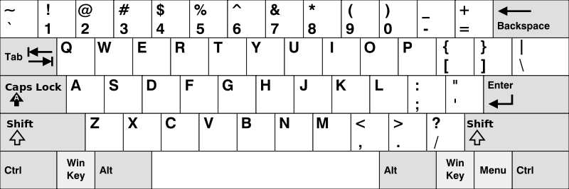

Учитывая массив строк `words`, верните слова, которые можно набрать с использованием букв алфавита только в одной строке американской клавиатуры, как показано на рисунке ниже .

**На американской клавиатуре :**
- первая строка состоит из символов `"qwertyuiop"`,
- вторая строка состоит из символов `"asdfghjkl"`, и
- третья строка состоит из символов `"zxcvbnm"`.

Пример 1:

Ввод: **word** = `["Привет","Аляска","Папа","Мир"]`
Выход: `["Аляска","Папа"]`

Пример 2:

Ввод: word = `["omk"]`
Вывод: `[]`

Пример 3:

Ввод: word = `["adsdf", "sfd"]`
Выход: `["adsdf", "sfd"]`

Ограничения:
- `1 <= words.length <= 20`
- `1 <= words[i].length <= 100`
- `words[i]`состоит из английских букв (как строчных, так и прописных). 
